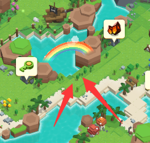

# 彩虹树的故事

在玩家完成过桥任务后，会见到鹿长老，和他对话后，即可领取该任务。

.png>)

鹿长老会告诉你，要找到不同颜色的7颗彩虹树，然后再回来找他。

7颗树的位置分别在以下位置。

.png>)

当玩家和所有树对话后，即可回来找鹿长老。继续任务。

此时鹿长老会告诉你一个谜语。谜语隐藏的信息是：天亮的时候在某处会有传送门打开。

可以在游戏时间06:00，在鹿长老左边一点的彩虹下找到一个传送门。进入后传送到一个隐藏房间，领取稀有的奖励！

